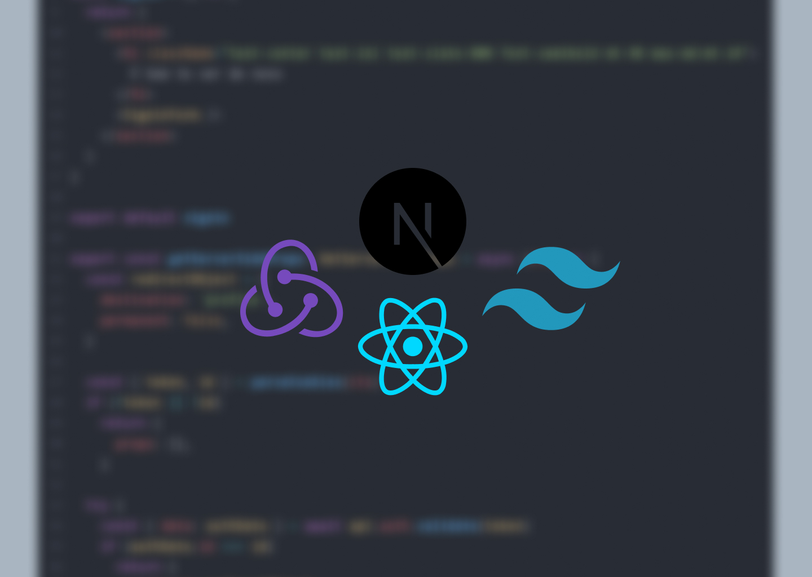

# Frontend para cadastro de usuários e produtos
<h4>Consumindo meu próprio backend: <a href="https://github.com/GabrielCoutz/nestjs-prisma-api">NestJS API com Prisma</a> </h4>

  

## Tópicos

 • <a href="#sobre">📋 Sobre o Projeto</a>  
 • <a href="#tecnologias">🔮 Tecnologias</a>  
 • <a href="#funcionalidades">🛠 Funcionalidades</a>  
 • <a href="#demonstração">🎥 Demonstração</a>  
 • <a href="#author">😎 Autor</a>  

---

<h2 id="sobre">📋 Sobre o projeto</h2>

Desenvolvendo este projeto tive um contato maior com o React e principalmente o NextJS, como utilizá-lo, e onde utilizá-lo.

Todos formulários foram feitos usando o React Hook Form, o que deixou o manuseio de dados, como consumir e validar, mais rápido e simples.

Tive o primeiro contato com o Tailwind, e como já me sinto muito confortável com o CSS Vanilla, utilizá-lo aumentou a produtividade em 1000%.

Também estão sendo feitos testes unitários, com Jest e React Testing Library, em toda aplicação.

Não é possível replicar o projeto com o container docker, **ainda**, porém a API está disponível em: <a href="https://github.com/GabrielCoutz/nestjs-prisma-api">github.com/GabrielCoutz/nestjs-prisma-api</a>

---

<h2 id="tecnologias">🔮 Tecnologias</h2>

      

---

<h2 id="funcionalidades">🛠 Funcionalidades</h2>

**Autenticação**

:white_check_mark: Validação para acessar a página de perfil, feita do lado do servidor com o `getServerSideProps()`.

:white_check_mark: Cookies para autenticação

**Estrutura**

:white_check_mark: <a href="https://betterprogramming.pub/compound-component-design-pattern-in-react-34b50e32dea0">Composite Pattern</a> utilizado

**Plus**

:white_check_mark: Documentação dos componentes com <a href="https://storybook.js.org/">Storybook</a>

:white_check_mark: Todos estados e efeitos são gerenciados pelo Redux

:white_check_mark: Feedback em todas ações realizadas (loading, error, alert...)

:white_check_mark: <a href="https://react-hook-form.com/">React Hook Form</a> utilizado

---

<h2 id="demonstração">📷 Demonstração</h2>

#### Desktop

https://user-images.githubusercontent.com/86968853/235247313-5b9cb4c3-8dc8-419c-b2ec-68c02c156396.mp4

#### Mobile

https://user-images.githubusercontent.com/86968853/235247360-ca59754b-6b24-41d5-baaa-6e1028b903e1.mp4

---

<h2 id="author">😎 Entre em contato</h2>

 

  Desenvolvido por <strong>eu mesmo😊</strong>

